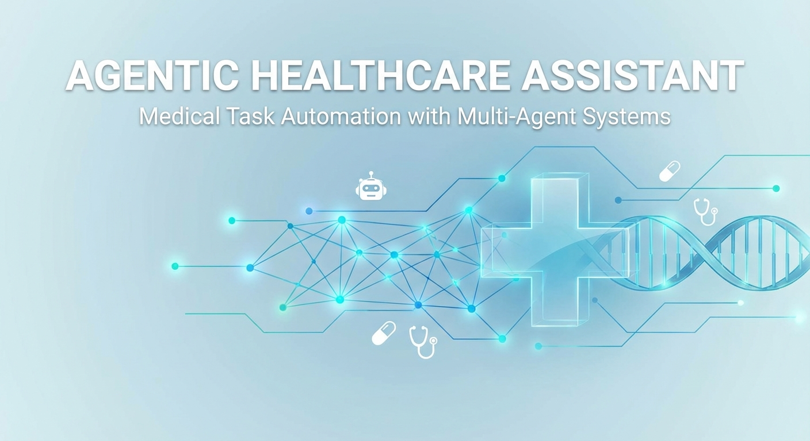
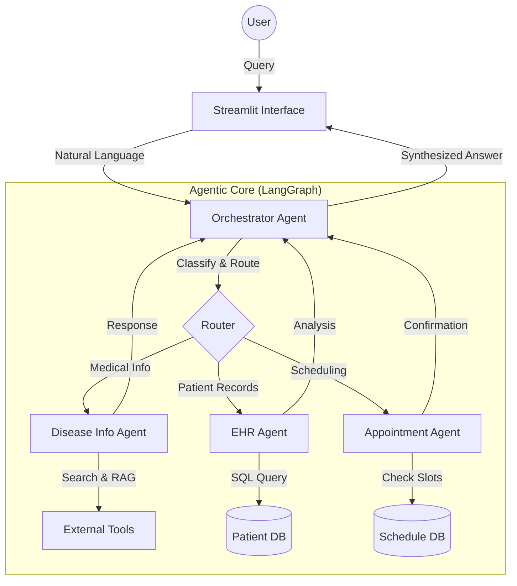

# Agentic Healthcare Assistant
## Medical Task Automation with Multi-Agent Systems



---

## 1. Executive Summary

The **Agentic Healthcare Assistant** is a sophisticated multi-agent system designed to automate and enhance various healthcare-related tasks. Built on **LangGraph** and powered by **Google Gemini**, this system leverages a network of specialized AI agents to provide accurate medical information, manage patient data, and handle appointment scheduling. By orchestrating these agents through a central intelligence, the system offers a unified, conversational interface for complex medical workflows, demonstrating the potential of agentic AI in healthcare.

## 2. Problem Statement

Modern healthcare workflows are often fragmented and data-intensive. Patients and providers face challenges such as:
*   **Information Overload**: Difficulty in synthesizing relevant medical information from vast databases.
*   **Disjointed Systems**: Patient records (EHR), scheduling systems, and medical knowledge bases often exist in silos.
*   **Administrative Burden**: Significant time is spent on routine tasks like scheduling and data retrieval.

There is a critical need for an intelligent layer that can bridge these systems, understand natural language intent, and execute multi-step tasks autonomously.

## 3. Solution Architecture

The solution is architected as a **Multi-Agent System (MAS)** where a central Orchestrator delegates tasks to specialized experts. This modular design ensures separation of concerns and allows for scalable development.

### System Diagram



### Core Components

1.  **Orchestrator Agent**: The "brain" of the system. It analyzes user input, determines intent (e.g., "What are the symptoms?" vs. "Who is patient P001?"), routes the request to the correct specialist, and synthesizes the final response.
2.  **Disease Info Agent**: A medical researcher agent. It uses **RAG (Retrieval-Augmented Generation)** and external search tools (Bing, Medline, WHO) to provide up-to-date medical information.
3.  **EHR Agent**: A data analyst agent. It securely interacts with the Electronic Health Record (EHR) database (SQLite) to retrieve patient history, vitals, and summaries.
4.  **Appointment Agent**: A scheduling coordinator. It manages calendar slots, checks availability, and books appointments using natural language (e.g., "Book a slot next Tuesday").

## 4. Key Features

### 🧠 Intelligent Routing
The system doesn't just match keywords; it understands context. A query like "Does patient P001 have a history of diabetes?" involves both the **EHR Agent** (to check history) and potentially the **Disease Info Agent** (for context), orchestrated seamlessly.

### 🔍 Retrieval-Augmented Generation (RAG)
To minimize hallucinations and ensure accuracy, the system uses RAG. It retrieves relevant context from a vector store (FAISS) or external APIs before generating answers, grounding the AI's knowledge in verified data.

### 🛡️ Robust Error Handling & Rate Limiting
Recognizing the constraints of real-world APIs, the system implements:
*   **Automatic Rate Limiting**: A custom `RateLimitedLLM` wrapper ensures API calls never exceed provider quotas (e.g., 15 requests/min), queuing requests intelligently.
*   **Graceful Degradation**: If an external service is down, the system falls back to cached data or informs the user clearly, rather than crashing.

### 💻 User-Friendly Interface
A polished **Streamlit** application provides:
*   **Chat Interface**: For natural conversation.
*   **Dedicated Dashboards**: For viewing structured patient data and appointment calendars.
*   **Visual Feedback**: Clear indicators for system status, memory usage, and agent actions.

## 5. Technical Implementation

The project is built on a modern, robust technology stack:

| Component | Technology | Purpose |
|-----------|------------|---------|
| **Orchestration** | LangGraph | Managing stateful agent workflows and cyclic graphs. |
| **LLM Framework** | LangChain | Interface for LLM interaction and tool binding. |
| **Intelligence** | Google Gemini (2.5 Pro) | High-performance reasoning and generation. |
| **Vector Store** | FAISS | Efficient similarity search for RAG. |
| **Database** | SQLite | Lightweight, reliable storage for structured patient data. |
| **Frontend** | Streamlit | Rapid development of interactive data apps. |

### Code Highlight: Rate Limiting
To ensure stability, a thread-safe rate limiter was implemented at the base agent level:

```python
class RateLimitedLLM:
    """Wrapper that adds rate limiting to LLM calls."""
    def invoke(self, *args, **kwargs):
        self._rate_limit_func()  # Enforces 4s delay
        return self._llm.invoke(*args, **kwargs)
```

## 6. Impact and Benefits

*   **Efficiency**: Reduces time spent on manual data lookup and scheduling by automating these tasks via natural language.
*   **Accuracy**: RAG pipelines ensure medical answers are grounded in trusted sources, reducing the risk of misinformation.
*   **Scalability**: The modular agent architecture allows new capabilities (e.g., Billing Agent, Lab Results Agent) to be added without rewriting the core system.
*   **User Experience**: Provides a unified, conversational entry point for complex medical systems, improving accessibility for healthcare providers.

## 7. Future Roadmap

*   **Real-time EHR Integration**: Replacing the SQLite mock with FHIR-compliant API connections (e.g., Epic, Cerner).
*   **Voice Interface**: Adding speech-to-text for hands-free operation in clinical settings.
*   **Multi-Modal Capabilities**: Analyzing medical imaging (X-rays, MRIs) using Gemini's vision capabilities.
*   **Advanced Security**: Implementing role-based access control (RBAC) and HIPAA-compliant audit logging.

---

*Generated by Sergio Oliveira (sergioro.2007@gmail.com)*
